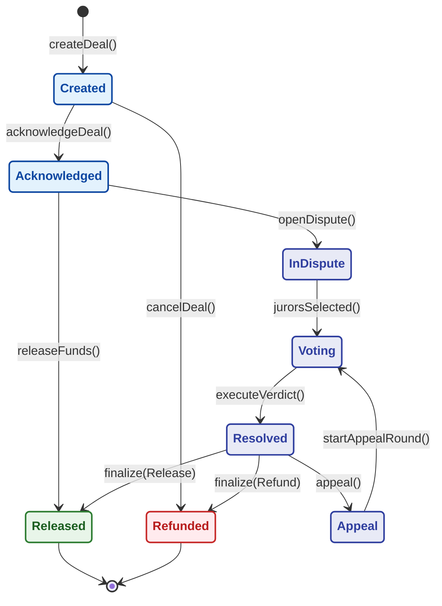
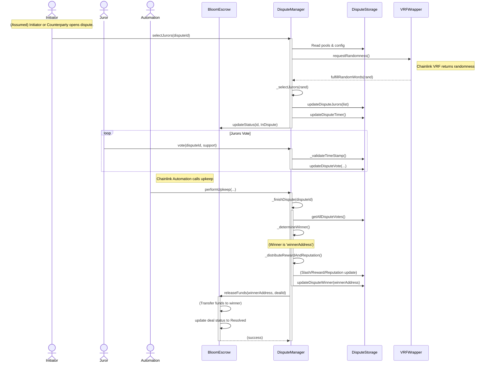
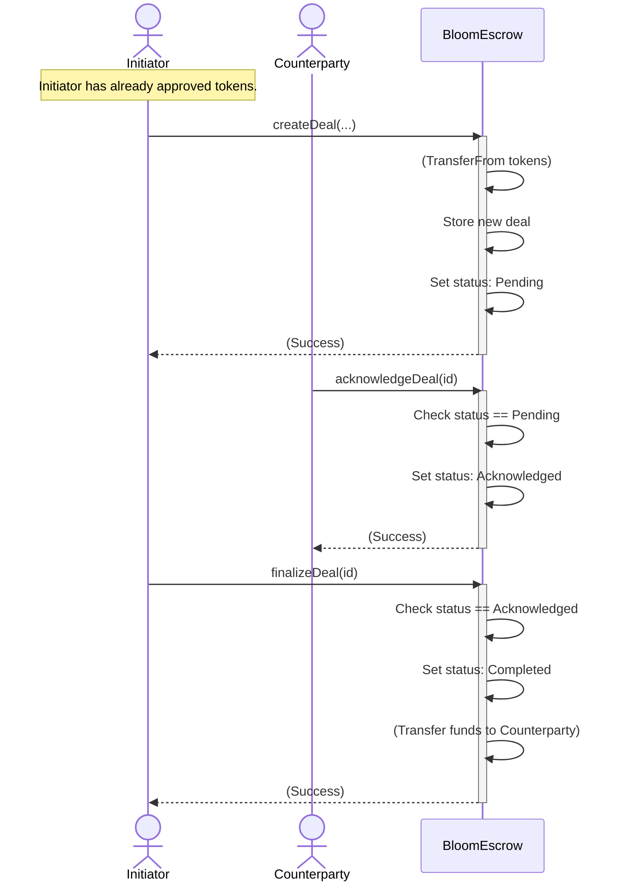

# 🏛️ System Architecture Diagrams

This file contains the high-level architecture models for the decentralized escrow and dispute system

---

## 1. Bloom State Machine

This diagram shows the complete lifecycle of a deal, from creation to resolution. It models the core logic of the smart contracts and defines all possible states.

## 1. Use Case Diagram

This diagram shows the complete lifecycle of a deal, from creation to resolution. It models the core logic of the `Escrow.sol` and `Dispute.sol` smart contracts and defines all possible states.

```mermaid

graph TD
    %% Define styles
    classDef userActor fill:#e8f5e9,stroke:#2e7d32,color:#1b5e20,font-weight:bold
    classDef systemActor fill:#e3f2fd,stroke:#0d47a1,color:#0d47a1,font-weight:bold
    classDef useCase fill:#f5f5f5,stroke:#616161,color:#212121,font-weight:bold

    %% Define Actors
    subgraph "Actors"
        A[Initiator]
        B[Counterparty]
        C[Juror]
        S[System - Smart Contract]
    end

    %% Define Use Cases
    subgraph "Use Cases"
        %% Initiator Cases
        U1(Create Deal)
        U2(Cancel Deal)
        U3(Release Funds)

        %% Counterparty Cases
        U4(Acknowledge Deal)

        %% Shared Cases
        U5(Open Dispute)
        U6(Submit Evidence)
        U7(Appeal)

        %% Juror Cases
        U8(Register Juror)
        U9(Vote)

        %% System Cases
        S1(Select Juror)
        S2(Finalize Deal)
        S3(Resolve Dispute)
    end

    %% Link Actors to Use Cases
    A --- U1
    A --- U2
    A --- U3
    A --- U5
    A --- U6
    A --- U7

    B --- U4
    B --- U5
    B --- U6
    B --- U7

    C --- U8
    C --- U9

    S --- S1
    S --- S2
    S --- S3

    %% Apply Styles
    class A,B,C userActor
    class S systemActor
    class U1,U2,U3,U4,U5,U6,U7,U8,U9,S1,S2,S3 useCase


```

